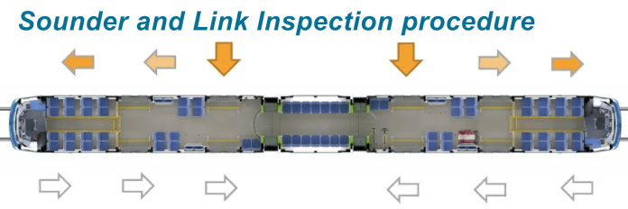
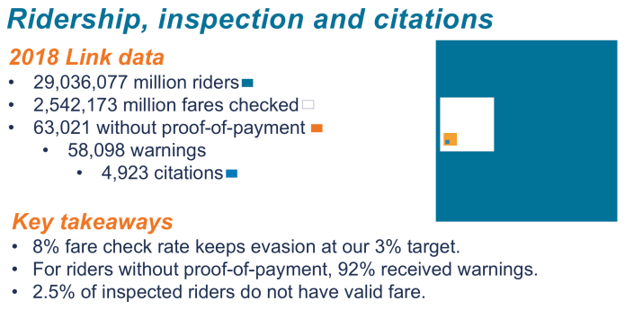

I spent last summer down in San Diego. In my time there, I predictably rode a lot of transit, both on NCTD and MTS. I have a lot of thoughts on it, but one of the more subtle complaints I have is how their fare enforcement works.

The MTS Trolley, like many light rail systems, uses a proof of payment system. You can buy a ticket from the TVM, tap a Compass card, or purchase a day pass on the MTS app.

The transit system I’m most familiar with is in Seattle, which has similar fare payment options to MTS. What’s different, however, is fare enforcement. In Seattle, officers get on the train car right before the doors close, ask everyone to get their fares ready, and then work their way through the train in a methodological manner so as to avoid profiling. They get out at the next stop, regardless of whether they’ve checked everyone.

On SoundTransit, if it’s your first infraction in 12 months, they will just give you a warning. Otherwise, the citation is $124. 

Also important to note is that the frequency of fare checks in Seattle is quite low. I have seen fare enforcement less than 10 times in my years of riding Seattle’s light rail. [SoundTransit still manages to have an impressively low fare evasion rate of 3%.](https://www.scribd.com/document/428704368/Sound-Transit-Fare-Enforcement-Procedure-Updates-October-2019#from_embed)

MTS is… a lot more disorganized. Not only that, but as far as I can gather, they don’t have any warning system. The first infraction is an immediate fine. Due to the disorganization though, I can’t find any information on that.

While I was riding the Trolley in San Diego, I had my fare checked on at least half my trips. Sometimes it would be checked multiple times on the same trip. One time, I even saw fare enforcement get on a train that there was already fare enforcement on!

Here are some things I experienced:

- Fare enforcement “randomly” checking people’s fares as they got off the train.
- Fare enforcement waving me on because I said I was just checked. (didn’t bother to verify)
- Fare enforcement giving me a thumbs up when I just showed them my Compass card. They didn’t actually tap their verification gadget on it to make sure I’d tapped on. This happened on the NCTD Coaster.
- Fare enforcement checking everyone on a train before letting the train leave the station.
- A random fare officer leaving a station who checked my fare as I was walking in. Would I have gotten a ticket if I was just wandering around?
- Fare enforcement ignoring a homeless person sleeping in the corner of the car. (I would have been dismayed to see him get a ticket, but still…)
- It seemed to me that there was a lot more fare enforcement on the Blue Line which heads to the border and is used by many Mexican workers coming to San Diego for day jobs from Tijuana. (more on this in a second)

As far as I could tell, I never saw any blatant profiling or discrimination. However, because of the poor methodology, it seems like there is plenty of room for fare officers to profile people. For random fare checks, it’s critical that they are applied fairly and uniformly across everyone.

Another interesting tidbit I found is that [apparently the MTS gets funding for their fare enforcement from the DHS](https://www.sdmts.com/sites/default/files/attachments/FS_TransitEnforc.pdf) (Department of Homeland Security). I can only presume this is because they provide access to the border, and it might explain why there is more enforcement on the Blue Line and why there’s so much enforcement in general.

The only document I could find containing information on the MTS’s fare enforcement procedures is [this PDF](https://www.sdmts.com/sites/default/files/Ordinance%20No.%202.pdf). It says that the first violation will carry a fine not exceeding $75 (I’ve heard it’s more… maybe they pass on court fees?). The second citation won’t exceed $500 (!) or 6 months imprisonment. All of this for failure to pay a $2.50 fare? 