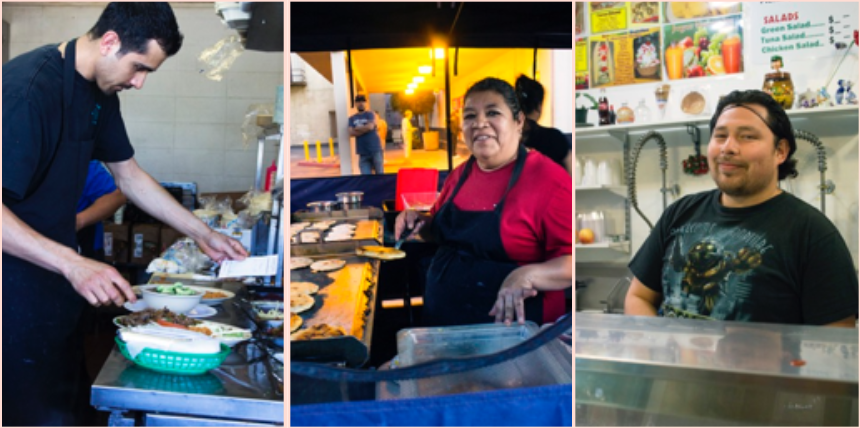
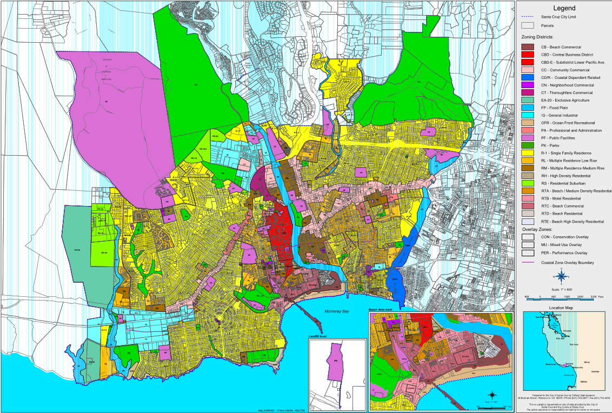

## UCSC Strike

As I write this, grad students at UCSC [are on strike](https://www.santacruzsentinel.com/2020/02/10/ucsc-graduate-students-go-on-strike/). They [are asking](https://payusmoreucsc.com/campaign-timeline/) for an additional $1,400 per month, on top of their current $2,400 salary, just to cover the cost of living in Santa Cruz. Is UCSC treating its student employees unfairly, or is UCSC just another victim of the exorbinante housing prices that Santa Cruz has created? 

Indeed, the cost of living in Santa Cruz is at a point where many would consider it a crisis. [It costs $2,200 to rent the average one bedroom apartment, and $3,300 to rent a two bedroom apartment.](https://www.rentjungle.com/average-rent-in-santa-cruz-rent-trends/) For UCSC grad students, the percentage of their yearly salary going to rent would be 123% for a one bedroom, or 76% for a bedroom in a two bedroom apartment. Regardless of whether you believe UCSC is exploiting their student employees, this is clearly an unacceptable situation. 

## Retail Workers

Every community has demand for low wage workers, including Santa Cruz. We have coffee shops, grocery stores, retail stores, and resturaunts that need employees. [UCSC released a research report](https://cpb-us-e1.wpmucdn.com/sites.ucsc.edu/dist/5/192/files/2015/11/Working-For-Dignity-Final-Report.pdf) in 2015 that surveyed low wage workers, and found that they were mostly making near minimum wage, which doesn't come close to being enough to afford rent in the county. 

> "67% of the County’s Latino population spends at least 30% of their income on housing, while only 41.4% of Whites do the same." - UCSC

For a town that considers itself one of the most progressive places on the west coast, this disparaity is striking. 

Anecdotally, my parents own a retail store in Capitola. Hiring employees has been an ongoing struggle, it's almost impossible to run a small business that pays retail workers enough to live in the area while also making a profit on the business. Incresingly, I have noticed businesses closed randomly because of "staffing shortages", and one Chinese resturaunt I frequent recently had to switch to take-out only because they couldn't afford staffing. 

For people that say that argue Santa Cruz is priced correctly for what a beautiful place it is, I ask you to analyze this situation with our low wage workers and whether you think it's fair. Not only that, but are we doing right by our small businesses to keep home prices so high?

## Least Affordable in the US

By many measures, Santa Cruz is one of the most [unaffordable](https://www.usatoday.com/story/money/2019/04/04/what-it-actually-costs-to-live-in-americas-most-expensive-cities/37748097/) [places to](https://www.theguardian.com/us-news/2016/aug/24/california-homelessness-santa-cruz-housing-affordability) [live in the US](https://sf.curbed.com/2016/8/24/12630262/santa-cruz-least-affordable). This situation is bad, and although the most powerful voices in our community are homeowners who can ignore the problem, it may become harder to ignore as small businesses close and the university struggles to house its employees. How did it get this way? Do we throw our hands up and blame Silicon Valley and the happening beach scene? 

Silicon Valley has undeniably created a huge amount of demand in Santa Cruz. It's one of the most desireable places to live, and we are essentially an extension of the Bay Area. The county hasn't been a slouch either, with [6% job growth](https://www.co.santa-cruz.ca.us/portals/0/SCWDB%202018%20Report.pdf) between 2007 and 2017. But was there nothing we could have done to prevent this situation? [According to the U.S. Department of Housing and Urban Development](https://www.co.santa-cruz.ca.us/portals/0/SCWDB%202018%20Report.pdf), Santa Cruz has built a tiny fraction of the number of homes that were needed to address demand. In fact, from June 2018 to June 2019, the county only authorized 130 new homes, a fraction of the 660 homes built annually between 2003 and 2006. 

> "In addition to topographical restraints, residential development has been clustered in small urbanized areas such as the cities of Santa Cruz, Scotts Valley, and Watsonville because development in many other areas has significant opposition from the community." - Dept. of Housing and Urban Development

For the next three years, HUD expects demand for 730 new homes, but there are currently just 60 planned. 

## Santa Cruz Housing Supply is Conservative Policy

The housing market is not a special case; economics 101 will tell us how the price will respond to various changes in supply and demand. In this case, supply has increased dramatically but supply has not kept up. 

The incredible demand for housing was generated by outside factors, but Santa Cruz has done very little to address it. The town has many old time residents who are nostalgic for the small town feeling that Santa Cruz was 40 years ago, but this resistance to change is actually hurting real people. For a place that considers itself progressive, it has been very effective at blocking new housing which would allow people to live closer to work while also addressing the skyrocketing housing costs.

Additionally, there is an attitude among residents that housing developers are greedy people who don't care about our community. But developers are the ones who will build new homes for people to live in, while those blocking the housing are creating this desparately inequitable situation. The lack of housing exacerbates racial divides while also forcing people to live further and further away from work, creating longer commutes, more traffic, and more pollution. 

The situation will not improve on its own. It will continue to be inequitable, unfair, and climate-damaging until more homes are built. If you have time, please visit city planning meetings and hearings for new developments to encourage the councils to approve them. We need all the new housing we can get. 